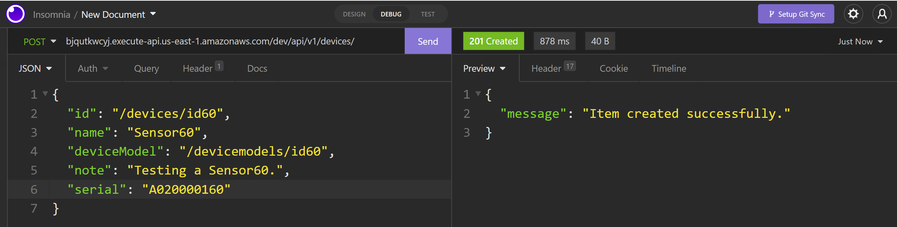
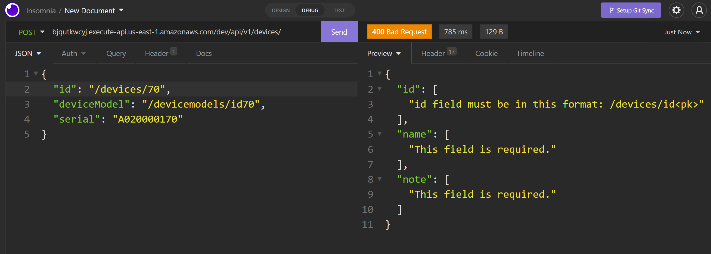
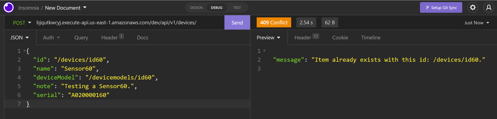
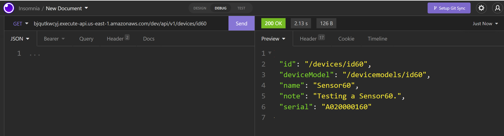
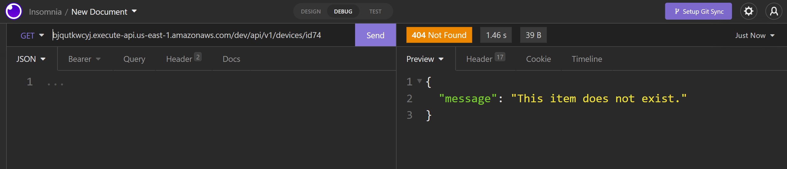
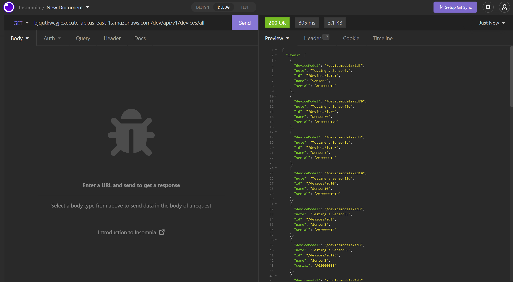

# Django Restful API Challenge

Implement a simple Restful API on Django using the following tech stack: Python, Django Rest Framework, AWS DynamoDB


## Getting Started
- [How to run this project?](#how-to-run-this-project)
- [Results and Test Cases](#results-and-tests)
- [Deploy on AWS Lambda func by zappa](#deploy-on-aws-lambda)


# How to run this project

### 1. Clone repository:
```bash
>>> git clone https://github.com/M-Taghizadeh/Django-Restful-API-Challenge.git
>>> cd Django-Restful-API-Challenge
```

### 2. install requerments.txt
 
- install python 3.10.3 from [here](https://www.python.org/downloads/release/python-3103/)

```bash
>>> python -m venv venv
>>> venv\Scripts\activate
```

On Linux
```bash
$ python -m venv venv
$ . venv/bin/activate
```

```bash
>>> cd .\config\
>>> pip install -r requirements.txt
```

### 3. AWS Cli Configuration
- Download AWS Cli from [here](https://docs.aws.amazon.com/cli/latest/userguide/getting-started-install.html) and install it.

- on aws cli terminal:

```bash
>>> aws configure
```

- Enter your IAM informations:

```bash
$ AWS Access Key ID [None]: ENTER YOUR ACCESSKEY
$ AWS Secret Access Key [None]: ENTER YOUR SECRETKEY
$ Default region name [None]: ENTER YOUR REGION
$ Default output format [None]: json
```

### 4. Aws DynamoDB

**You can Skip this section if the table already exists in dynmaoDB**

After entering the AWS Secret variables, we can use dynamodb migrator to create our nosql database.

```bash 
>>> python aws_dynamodb_migrator.py
```

After this, on AWS Dynamodb, we will see our database with the name "Device_DB", you can check it.
You can see it in the list of tables.
```bash
>>> aws dynamodb list-tables
```

### 5. Enter Your secret variables
- in settings.py : config/config/settings.py

You can also use online tools for django secret key generator.

```python
# SECURITY WARNING: keep the secret key used in production secret!
SECRET_KEY = os.getenv("YOUR_DJANGO_SECRET_KEY")
```

- in device_app/api/views.py

```python
# Get the dynamodb using boto3
dynamodb = boto3.resource(
    "dynamodb",
    aws_access_key_id = "YOUR_AWS_ACCESS_KEY_ID",
    aws_secret_access_key = "YOUR_AWS_SECRET_ACCESS_KEY",
    region_name = "YOUR_AWS_REGION_NAME",
)
```

### 6. Run server and use it :)
```bash
>>> cd .\config
>>> python .\manage.py runserver
```


# Results and Tests

## Results
|HTTP Method |URL                                                                  |Functionality
|------------|---------------------------------------------------------------------|------------------
|POST        |bjqutkwcyj.execute-api.us-east-1.amazonaws.com/dev/api/v1/devices/   |Create new Device
|GET         |bjqutkwcyj.execute-api.us-east-1.amazonaws.com/dev/api/v1/devices/id1|Get Device by id
|GET         |bjqutkwcyj.execute-api.us-east-1.amazonaws.com/dev/api/v1/devices/all|Get all Devices

### Request 1 : Create New Device

|HTTP Method |URL                                                               |
|------------|------------------------------------------------------------------|
|POST        |bjqutkwcyj.execute-api.us-east-1.amazonaws.com/dev/api/v1/devices/|

```python
Body (application/json):
{
  "id": "/devices/id1",
  "deviceModel": "/devicemodels/id1",
  "name": "Sensor",
  "note": "Testing a sensor.",
  "serial": "A020000102"
}
```

### Response 1 - Success:
- **HTTP 201** Created



### Response 1 - Failure 1:
- **HTTP 400** Bad Request

If any of the payload fields are missing. Response body should have a descriptive error message for the client to be able to detect the problem.



### Response 1 - Failure 2:
- **HTTP 409** Conflict Error

If Item was already exists with this id.



<hr>

### Request 2 : Get Device 

|HTTP Method |URL                                                                  |
|------------|---------------------------------------------------------------------|
|GET         |bjqutkwcyj.execute-api.us-east-1.amazonaws.com/dev/api/v1/devices/id1|


### Response 2 - Success:
- **HTTP 200** OK



### Response 2 - Failure 1:
- **HTTP 404** Not Found

If the request id does not exist.




<hr>

### Request 3 : Get All Devices 

|HTTP Method |URL                                                                  |
|------------|---------------------------------------------------------------------|
|GET         |bjqutkwcyj.execute-api.us-east-1.amazonaws.com/dev/api/v1/devices/all|

### Response 3 - Success:
- **HTTP 200** OK




<hr>

## Automated Tests
This project is completely TestCase oriented and you can add other tests in the device_app/tests.py file. the six important and key test cases requested in the challenge have been successfully passed. You can use these endpoints with API platforms like **postman** or **insomnia**. You can also run test cases with the following command.

- Tests Directory

```bash
.\config\device_app\tests.py
```

- you can see the tests and add your test cases in this file

```python
from django.urls import reverse
from rest_framework import status
from rest_framework.test import APIClient, APISimpleTestCase


client = APIClient()

class TestGetDevice_API(APISimpleTestCase):
    """Test class for GetDevice_API endpoint view"""

    def test_case1_get_device_valid(self):
        response = client.get("http://127.0.0.1:8000/api/v1/devices/id1/")
        self.assertEqual(response.status_code, status.HTTP_200_OK)

    def test_case2_get_device_invalid(self):
        response = client.get("http://127.0.0.1:8000/api/v1/devices/id567/")
        self.assertEqual(response.status_code, status.HTTP_404_NOT_FOUND)


class Test_CreateDevice_API(APISimpleTestCase):
    """Test class for create a new Device using CreateDevice_API endpoint view"""

    def setUp(self):
        self.payload1_valid = {
            "id": "/devices/id5",
            "deviceModel": "/devicemodels/id5",
            "name": "Sensor5",
            "note": "Testing a sensor5.",
            "serial": "A020000105",
        }

        self.payload2_invalid = {
            "id": "", # id required field
            "deviceModel": "/devicemodels/id2",
            "name": "", # name required field
            "note": "Testing a sensor2.", 
            # serial required field
        }

        self.payload3_invalid = {
            "id": "4", # id format is invalid : must be in this format => /devices/id<pk>
            "deviceModel": "/devicemodels/id4",
            "name": "Sensor4",
            "note": "Testing a sensor4.",
            "serial": "A020000104",
        }

    def test_case1_create_device_valid(self):
        response = client.post("http://127.0.0.1:8000/api/v1/devices/", self.payload1_valid)
        self.assertEqual(response.status_code, status.HTTP_201_CREATED)

    def test_case2_create_device_invalid(self):
        response = client.post("http://127.0.0.1:8000/api/v1/devices/", self.payload2_invalid)
        self.assertEqual(response.status_code, status.HTTP_400_BAD_REQUEST)

    def test_case3_create_device_invalid(self):
        response = client.post("http://127.0.0.1:8000/api/v1/devices/", self.payload3_invalid)
        self.assertEqual(response.status_code, status.HTTP_400_BAD_REQUEST)
    
    def test_case4_create_device_invalide(self):
        response = client.post("http://127.0.0.1:8000/api/v1/devices/", self.payload1_valid)
        self.assertEqual(response.status_code, status.HTTP_409_CONFLICT) # item already exist
```

- run the tests

```bash
>>> cd .\config
>>> python .\manage.py test   
```

- Tests Outputs

```bash
Found 6 test(s).
System check identified no issues (0 silenced).
......
----------------------------------------------------------------------
Ran 6 tests in 2.456s

OK
```

<hr>

# Deploy on AWS lambda

### Zappa - Serverless Python
Zappa makes it super easy to build and deploy server-less, event-driven Python applications (Django or Flask) on AWS Lambda + API Gateway + S3. 

- https://github.com/zappa/Zappa

We can deploy our python project on lambda and S3 buckets using zappa in the following three steps :)

```bash
$ pip install zappa
$ zappa init
$ zappa deploy
```

